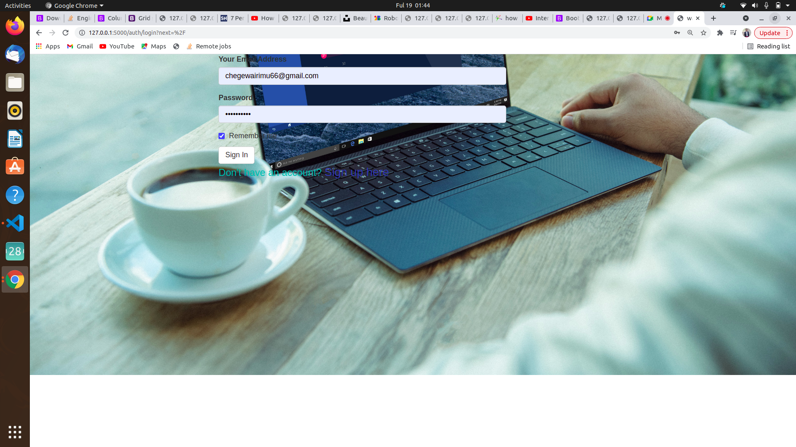
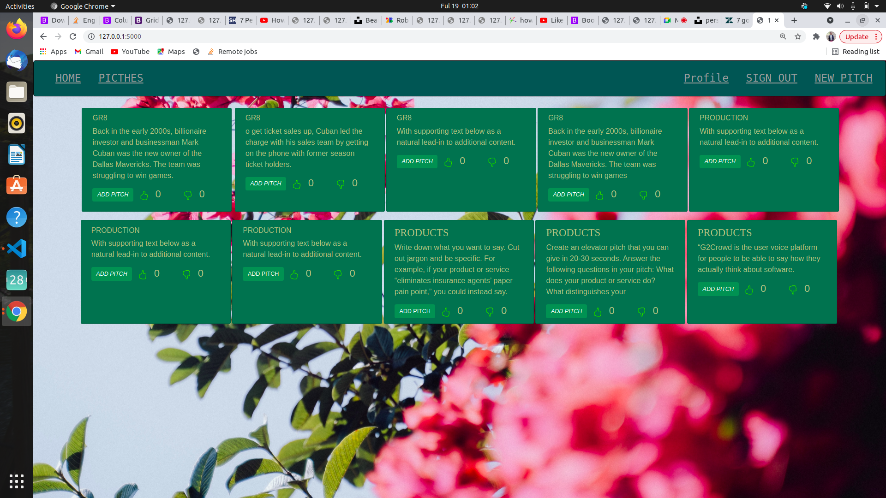
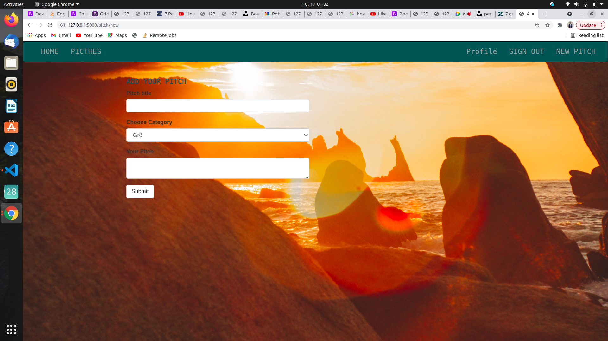
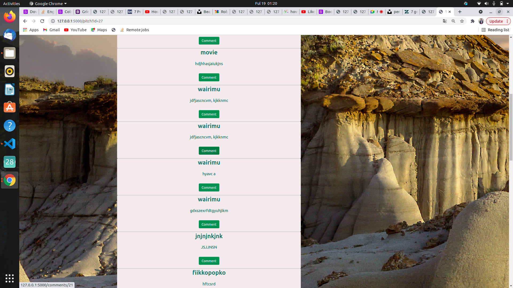

# Pitch App

## Date, 19/08/2021

## By Peter Chege Wairimu.

# Description 

Pitch app is an app where users get to read pitches,add apitch and also comment and like a pitch that got them intrested.

# Instructions

(i). Sign up inorder to access the app,

(ii). Click on the add pitch button in order to comment and also add apitch,

(iii).Live a like or disklike in any pitch you choose.

# Technologies Used

### (1).HTML.

### (2).Css.

### (3).Bootstrap.

### (4). Javascript.

### (5). Python.

## 

# Support and contact details
Incase of any queries or any clarification you can contact me via email or phone.

### email. chegewairimu66@gmail.com

### phone. 0707569387

# License

License permission is hereby granted ,free of charge to anyone obtaining a copy of these software and associated documentation to deal in the software without restrictions including without limitation the rights to use ,copy modify ,publish and distribute copies of these software and to permit persons to whom the software is furnished to do so,subject to the following conditions:

The above copyright notice should be included.

## Copyright (c) 2021